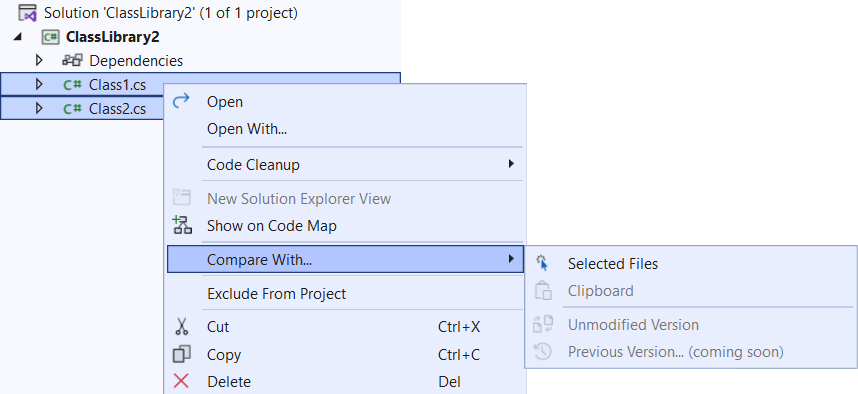
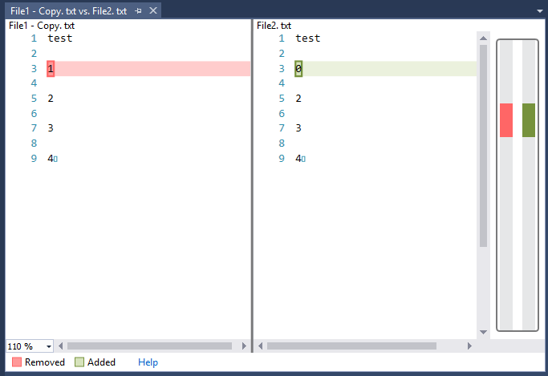
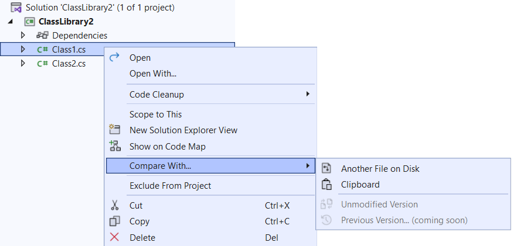

# File Differ

Download this extension from the [VS Gallery](https://visualstudiogallery.msdn.microsoft.com/9b4f1f00-492d-48bc-8857-702332217b67)
or get the [CI build](http://vsixgallery.com/extension/ea5c68d6-cdae-4e79-bd46-2a39e95bb256/).

---------------------------------------

The easiest way to diff two files directly in solution explorer. This extension is inspired by a Visual Studio [feature request](https://developercommunity.visualstudio.com/t/is-there-a-way-to-compare-two-files-from-solution/619706), so please vote for it if you think it should be built in.

## Features

- Compare two files in Solution Explorer
- Compare file with another file on disk
- Compare file with content of clipboard
- Compare file with unmodified version (git)
- Compare file with previous version (git) - *not yet implemented*

### Compare selected files
Select two files in Solution Explorer and right-click to bring up the context menu.

Then select *Selected Files* to see them side-by-side in the diff view.

### Compare with a file on disk
If you only selected a single file, a file selector prompt will show up to let you select which file on disk to diff against.

### Compare with clipboard
If there is text content on the clipboard, you can compare a file with it by selecting *Clipboard* from the context menu.

## License
[Apache 2.0](LICENSE)