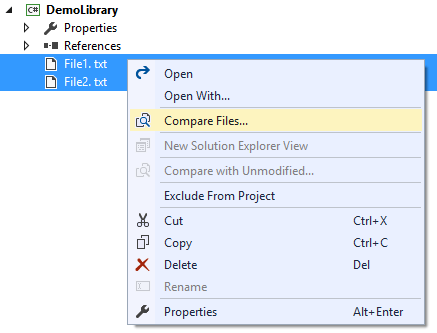
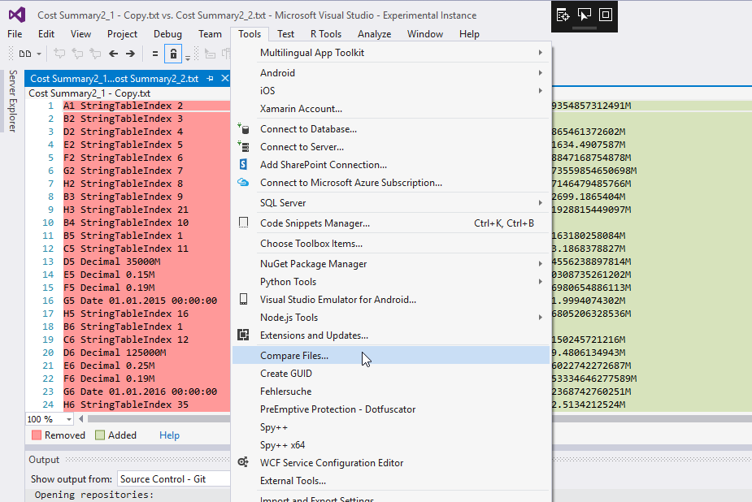

# File Differ

Download this extension from the [VS Gallery](https://visualstudiogallery.msdn.microsoft.com/9b4f1f00-492d-48bc-8857-702332217b67)
or get the [CI build](http://vsixgallery.com/extension/ea5c68d6-cdae-4e79-bd46-2a39e95bb256/).

---------------------------------------

The easiest way to diff two files directly in solution explorer

See the [changelog](CHANGELOG.md) for changes and roadmap.

## Features

- Compare two files in Solution Explorer
- Compare a file with any other file on disk
- Compare any two files from disk via 'Tool' menu

### Compare files

#### Option 1

Select one or two files in Solution Explorer and
right-click.

Then select *Compare Files...* to see the 
diff view.

If you only selected a single file, a file
selector prompt will show up to let you select
which file to diff against.

#### Option 2

If you select main menu 'Tools'&#8594;'Compare Files...', 
you will be prompted twice for the files to compare.

## Contribute
Check out the [contribution guidelines](CONTRIBUTING.md)
if you want to contribute to this project.

For cloning and building this project yourself, make sure
to install the
[Extensibility Tools 2015](https://visualstudiogallery.msdn.microsoft.com/ab39a092-1343-46e2-b0f1-6a3f91155aa6)
extension for Visual Studio which enables some features
used by this project.

## License
[Apache 2.0](LICENSE)